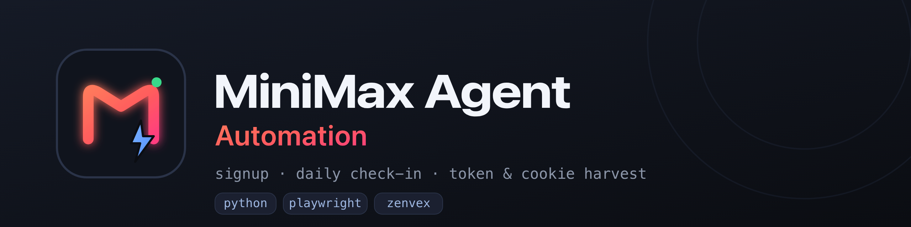

<div align="center">



# MiniMax Agent Automation

**Registro automático de cuentas · check-in diario · extractor de JWT y cookies de sesión para [agent.minimax.io](https://agent.minimax.io/)**

Con email desechable de [Zenvex](https://zenvex.dev) + [Playwright](https://playwright.dev).

[](LICENSE)
[](https://www.python.org/)
[](https://playwright.dev)
[]()
[](CONTRIBUTING.md)
[](https://github.com/0xgetz/minimax-agent-automation/stargazers)

[English](README.md) · [Bahasa Indonesia](README.id.md) · **Español** · [中文](README.zh.md) · [日本語](README.ja.md)

</div>

---

## Descripción

`minimax-agent-automation` controla un navegador real para crear una cuenta de
**MiniMax Agent** de principio a fin con un correo desechable, realiza el
**check-in diario** y exporta el **token JWT + cookies de sesión + almacenamiento
del navegador** como JSON.

No reproduce la API privada de MiniMax (firmada por petición y con token de auth
cifrado). En su lugar pulsa la interfaz real, por lo que sigue funcionando cuando
el sitio cambia por dentro.

## Características

| | |
|---|---|
| 🚀 **Un comando** | `python3 minimax_auto.py` — registro, verificación, check-in, exportación |
| 📧 **Correo desechable** | Bandeja aleatoria `@souss.dev` vía Zenvex, leída por su API JSON |
| 🔐 **Exportación completa** | JWT `_token`, todas las cookies, `localStorage`, `sessionStorage` |
| ✅ **Check-in diario** | Reclama los créditos diarios automáticamente |
| 🔢 **Modo masivo** | `--count N` crea N cuentas secuencialmente |
| 🧩 **Sin API keys** | Sin registro ni claves — solo un navegador |

## Cómo funciona

```
Bandeja Zenvex ──► agent.minimax.io (Sign in) ──► email ──► términos ──► contraseña
                                                                    │
     token + cookies + storage ◄── check-in ◄── código verificación ◄┘
```

1. Genera una dirección Zenvex aleatoria.
2. Abre `agent.minimax.io` y pulsa **Sign in** — esto crea el OAuth `state`
   que necesita el callback.
3. Introduce el email → acepta términos → **Continue** → crea una contraseña.
4. Consulta la API de Zenvex y lee el código de 6 dígitos **del cuerpo del correo**.
5. Envía el código → quedas conectado.
6. Pulsa **Check in for N** en el popup diario.
7. Exporta `_token` + cookies + storage a un `.jsonl`.

## Instalación

```bash
git clone https://github.com/0xgetz/minimax-agent-automation.git
cd minimax-agent-automation

python -m venv .venv
source .venv/bin/activate        # Windows: .venv\Scripts\activate

pip install -r requirements.txt
python -m playwright install --with-deps chromium
```

> Si `--with-deps` no alcanza tu mirror de paquetes, instala manualmente las
> librerías de Chromium (`libglib2.0-0 libnss3 libnspr4 libatk1.0-0 libatk-bridge2.0-0
> libcups2 libdrm2 libxkbcommon0 libxcomposite1 libxdamage1 libxfixes3 libxrandr2
> libgbm1 libpango-1.0-0 libcairo2 libasound2 libatspi2.0-0`).

## Uso

```bash
python3 minimax_auto.py                     # 1 cuenta
python3 minimax_auto.py --count 3           # 3 cuentas, secuencial
python3 minimax_auto.py --domain souss.dev  # dominio de correo temporal
python3 minimax_auto.py --headful           # ver el navegador
python3 minimax_auto.py --out accounts.jsonl
python3 minimax_auto.py --keep-open         # dejar el navegador abierto (debug)
```

| Flag | Por defecto | Descripción |
|------|-------------|-------------|
| `--count` | `1` | Número de cuentas a crear |
| `--domain` | `souss.dev` | Dominio receptor de Zenvex |
| `--password` | `ZenvexMiniMax2026!x` | Contraseña de las cuentas creadas |
| `--out` | `minimax_accounts.jsonl` | Archivo de salida (se añade) |
| `--headful` | off | Mostrar la ventana del navegador |
| `--keep-open` | off | No cerrar el navegador (debug) |

## Formato de salida

Un objeto JSON por línea (ver [`examples/minimax_account.example.json`](examples/minimax_account.example.json)):

```json
{
  "site": "https://agent.minimax.io/",
  "account": {
    "email": "5ie22i0f@souss.dev",
    "password": "ZenvexMiniMax2026!x",
    "userName": "MiniMax853738",
    "userID": "35zvxoxqYmQ2",
    "realUserID": "561636901788553221"
  },
  "token_jwt": "eyJhbGciOiJIUzI1NiIs...",
  "cookie_header": "_fbp=...; _token=eyJ...; _sid=...",
  "cookies": [ { "name": "_token", "value": "eyJ...", "domain": "agent.minimax.io" } ],
  "localStorage": { "_token": "eyJ...", "user_detail_agent": "{...}" },
  "sessionStorage": { "mavis:activeAgentId": "..." },
  "checkin": true,
  "captured_at": 1790762452
}
```

## Notas de implementación

- **La API de MiniMax está firmada por petición** (`x-timestamp`, `x-signature`,
  `yy` + `authToken` cifrado). El script maneja la UI en lugar de reproducirla.
- **El OAuth `state` es obligatorio.** Abrir `/unified-login` directamente →
  **HTTP 400** en el callback — empieza siempre desde `agent.minimax.io` → *Sign in*.
- **La casilla de términos es un `<button>` sin etiqueta** — el clic real de
  Playwright cambia el estado de React; un `.click()` JS simple no.
- **Lee el código solo del cuerpo del correo.** `\d{6}` sobre todo el JSON captura
  dígitos de `received_at`/ids y devuelve un código incorrecto.
- **Zenvex necesita la cabecera `x-zenvex-csrf`** (valor de la cookie `zvx_csrf`)
  y un origen de navegador, si no → `403`. Su Turnstile pasa en un navegador real.
- **MiniMax reutiliza el mismo código al reenviar** y expiran en ~5 minutos.

## Estructura del proyecto

```
minimax-agent-automation/
├── minimax_auto.py                     # el script de automatización
├── requirements.txt
├── LICENSE
├── CONTRIBUTING.md
├── SECURITY.md
├── README.md  README.id.md  README.es.md  README.zh.md  README.ja.md
├── assets/                             # logo + banner (SVG & PNG)
└── examples/minimax_account.example.json
```

## Aviso legal

Solo para **uso educativo y de automatización personal**. Eres responsable de
cumplir los términos de servicio de MiniMax y Zenvex. No lo uses para registrar
cuentas en masa, eludir límites de velocidad o abusar del servicio. Los autores
no se hacen responsables de ningún uso indebido.

## Licencia

[MIT](LICENSE) © 2026 0xgetz
